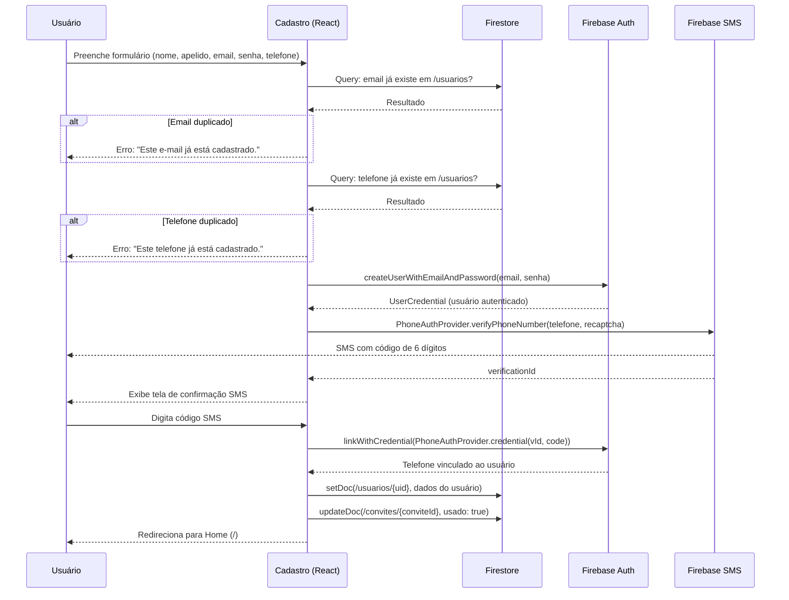

# TDD: Verificação de Duplicatas e Vinculação de Telefone no Cadastro

| Campo            | Valor                                      |
|------------------|--------------------------------------------|
| **Tech Lead**    | Emerson Rocco                              |
| **Time**         | Bolão do Bolero                            |
| **Status**       | Implementado                               |
| **Criado em**    | 2026-04-01                                 |
| **Atualizado em**| 2026-04-01                                 |

---

## 1. Contexto

O **Bolão do Bolero** é um bolão de apostas entre amigos para a Copa do Mundo FIFA 2026. O acesso é controlado por convites gerados pelo administrador; cada participante se cadastra via um link de convite único.

O sistema utiliza **Firebase Auth** para autenticação e **Firestore** como banco de dados. O cadastro coleta nome, apelido, e-mail, senha e telefone. Após o registro, o usuário pode fazer login por e-mail/senha, link por e-mail, telefone (SMS) ou Google OAuth.

Anteriormente, o telefone era apenas armazenado no Firestore como campo de texto, sem vínculo com o Firebase Auth. Isso significava que o login via telefone só funcionava se o usuário vinculasse manualmente o número na tela de perfil. Além disso, não havia validação de unicidade de e-mail e telefone no Firestore, dependendo apenas do Firebase Auth para rejeitar e-mails duplicados.

---

## 2. Problema e Motivação

### Problemas identificados

1. **Login por telefone indisponível após cadastro** — O telefone informado no cadastro era salvo apenas no Firestore. O usuário precisava ir manualmente à tela de Perfil → Vincular Telefone para poder usar login via SMS. A maioria dos usuários não fazia isso, tornando o login por telefone inutilizável na prática.

2. **Ausência de validação de duplicatas no Firestore** — O Firebase Auth impede e-mails duplicados nativamente (`auth/email-already-in-use`), mas o telefone não passava por nenhuma validação. Dois usuários poderiam cadastrar o mesmo número de telefone no Firestore sem erro. Além disso, a verificação de e-mail no Firestore garante feedback mais rápido e mensagens de erro mais claras antes de tentar criar o usuário no Auth.

3. **Experiência de onboarding incompleta** — O fluxo ideal é: cadastrar → ter todas as opções de login disponíveis imediatamente. Exigir etapas manuais pós-cadastro gera atrito e confusão.

### Por que agora

A Copa do Mundo 2026 se aproxima. Novos participantes estão sendo convidados, e muitos preferem login via SMS por ser mais simples. Garantir que o telefone esteja vinculado desde o cadastro é essencial para uma boa experiência.

### Consequências da inação

- Participantes incapazes de usar login por telefone sem intervenção manual.
- Possibilidade de telefones duplicados no sistema, causando conflitos em notificações e identificação.
- Suporte manual desnecessário do administrador para resolver problemas de login.

---

## 3. Escopo

### Em Escopo (V1)

- Verificação de e-mail duplicado no Firestore antes de criar o usuário no Firebase Auth.
- Verificação de telefone duplicado no Firestore antes de criar o usuário.
- Fluxo de cadastro multi-step: formulário → verificação SMS → conclusão.
- Vinculação automática do telefone ao Firebase Auth via `linkWithCredential` com `PhoneAuthProvider`.
- Tratamento de erros específicos para cada etapa (duplicatas, SMS, vinculação).
- RecaptchaVerifier invisível para verificação de telefone.

### Fora de Escopo (V1)

- Reenvio automático de SMS com cooldown — o usuário pode reiniciar o fluxo voltando ao formulário.
- Validação de formato de telefone no frontend (máscara de input) — aceita texto livre com placeholder orientativo.
- Cloud Function para validação server-side de duplicatas — a verificação ocorre client-side via queries Firestore; as Security Rules protegem contra criação indevida.
- Migração de usuários existentes que já cadastraram sem telefone vinculado — devem usar a tela de Perfil existente.

### Considerações Futuras (V2+)

- Máscara de input para telefone com formatação automática (+55...).
- Cloud Function `onCreate` para validar duplicatas server-side como camada adicional de segurança.
- Fluxo de reenvio de SMS com timer de cooldown (ex: 60 segundos).
- Notificação ao admin quando um novo usuário completa o cadastro.

---

## 4. Solução Técnica

### 4.1 Visão Geral da Arquitetura

O fluxo de cadastro é inteiramente client-side, orquestrado pelo componente React `Cadastro.tsx`. Não há Cloud Functions envolvidas no registro.



### 4.2 Componentes Modificados

| Componente | Arquivo | Mudança |
|---|---|---|
| Cadastro | `src/pages/Cadastro.tsx` | Reescrito: multi-step, verificação de duplicatas, vinculação de telefone |

### 4.3 Fluxo de Dados

**Step 1 — Formulário (`step === 'form'`)**

1. Usuário preenche todos os campos e submete.
2. Valida convite (existe e não foi usado).
3. Consulta Firestore para duplicatas:
   - `query(usuarios, where('email', '==', email))` — verifica e-mail.
   - `query(usuarios, where('telefone', '==', telefone))` — verifica telefone.
4. Se sem duplicatas: `createUserWithEmailAndPassword(email, senha)`.
5. Inicializa RecaptchaVerifier invisível.
6. `PhoneAuthProvider.verifyPhoneNumber(telefone, recaptcha)` — envia SMS.
7. Armazena `verificationId` no state e avança para step `'sms'`.

**Step 2 — Confirmação SMS (`step === 'sms'`)**

1. Usuário digita o código de 6 dígitos recebido por SMS.
2. `PhoneAuthProvider.credential(verificationId, smsCode)` — cria credencial.
3. `linkWithCredential(auth.currentUser, credential)` — vincula telefone ao Auth.
4. `setDoc(usuarios/{uid})` — cria documento do usuário no Firestore.
5. `updateDoc(convites/{conviteId})` — marca convite como usado.
6. Redireciona para `/`.

### 4.4 Queries no Firestore

| Query | Collection | Filtro | Índice necessário |
|---|---|---|---|
| Verificar e-mail duplicado | `usuarios` | `where('email', '==', value)` | Automático (equality) |
| Verificar telefone duplicado | `usuarios` | `where('telefone', '==', value)` | Automático (equality) |

### 4.5 APIs do Firebase Auth Utilizadas

| Método | Propósito |
|---|---|
| `createUserWithEmailAndPassword` | Cria conta com email/senha |
| `PhoneAuthProvider.verifyPhoneNumber` | Inicia verificação SMS, retorna `verificationId` |
| `PhoneAuthProvider.credential` | Cria credencial a partir de `verificationId` + código SMS |
| `linkWithCredential` | Vincula a credencial de telefone à conta existente |
| `RecaptchaVerifier` | Requisito do Firebase para verificação de telefone (modo invisível) |

### 4.6 Modelo de Dados

**Collection: `usuarios/{uid}`** (sem alteração no schema)

```json
{
  "nome": "João Silva",
  "apelido": "Joãozinho",
  "email": "joao@email.com",
  "telefone": "+5511999999999",
  "role": "participante",
  "conviteId": "abc123",
  "criadoEm": "Timestamp"
}
```

O schema não muda. A diferença é que agora o campo `telefone` corresponde a um provider efetivamente vinculado no Firebase Auth, não apenas um campo de texto informativo.

**Firebase Auth User** (após cadastro)

O usuário terá dois providers vinculados:
- `password` (email/senha)
- `phone` (número verificado por SMS)

---

## 5. Considerações de Segurança

### Autenticação e Autorização

- O cadastro exige um convite válido e não utilizado. Sem convite, ninguém cria conta.
- O Firebase Auth gerencia a criação de conta e vinculação de providers. Tokens JWT são validados automaticamente pelo Firebase SDK.
- As Firestore Security Rules exigem `isOwner(uid)` para criar/atualizar documentos de usuário, e `isAuthenticated()` para atualizar convites.

### Verificação de Telefone

- O Firebase exige RecaptchaVerifier para prevenir abuso de SMS.
- O código SMS tem validade limitada (definida pelo Firebase, tipicamente 5 minutos).
- Tentativas excessivas são bloqueadas pelo Firebase (`auth/too-many-requests`).

### Validação de Duplicatas

- A verificação de duplicatas ocorre no client-side via queries Firestore. Isso é uma verificação de UX (feedback rápido), não uma garantia de segurança.
- O Firebase Auth já impede e-mails duplicados nativamente. Para telefones, o `linkWithCredential` falha com `auth/credential-already-in-use` se o número já estiver vinculado a outra conta no Auth.
- Há uma janela de race condition entre a verificação e a criação (outro cadastro simultâneo), mas dado o modelo de convites individuais e o grupo pequeno de amigos, o risco é desprezível.

### Dados Sensíveis

| Dado | Armazenamento | Proteção |
|---|---|---|
| Senha | Firebase Auth (hash bcrypt/scrypt) | Nunca exposta; gerida pelo Firebase |
| E-mail | Firebase Auth + Firestore | Acesso via Security Rules (autenticados) |
| Telefone | Firebase Auth + Firestore | Acesso via Security Rules (autenticados) |
| Código SMS | Memória do client (state React) | Descartado após uso; não persistido |

### Regras de Firestore Relevantes

As regras existentes já suportam o novo fluxo sem alteração:

- `/usuarios/{uid}` — `create: if isOwner(uid)` — o usuário recém-criado pode criar seu próprio documento.
- `/convites/{conviteId}` — `read: if true` — qualquer um pode verificar se o convite é válido. `update: if isAuthenticated()` — o usuário recém-autenticado pode marcar como usado.

---

## 6. Riscos

| Risco | Impacto | Probabilidade | Mitigação |
|---|---|---|---|
| SMS não chega ao usuário (operadora, número incorreto) | Alto — cadastro fica incompleto; usuário criado no Auth sem documento no Firestore | Baixa | Tratamento de erro orienta o usuário. Conta Auth sem documento Firestore não tem acesso ao app (verificado no login). Admin pode excluir a conta Auth órfã se necessário. |
| Race condition na verificação de duplicatas | Baixo — dois convites com mesmo email/telefone processados simultaneamente | Muito Baixa | Firebase Auth rejeita emails duplicados. `linkWithCredential` rejeita telefones já vinculados. Grupo pequeno e convites individuais tornam cenário improvável. |
| Sessão expira entre step 1 e step 2 | Médio — usuário precisa recomeçar | Baixa | Verificação `auth.currentUser` no step 2. Mensagem clara de erro com redirecionamento ao formulário. |
| RecaptchaVerifier falha em browsers com extensões de privacidade | Médio — SMS não pode ser enviado | Baixa | RecaptchaVerifier usa modo invisível (menor fricção). Erro é capturado e exibido. Usuário pode tentar outro browser. |
| Custo de SMS do Firebase | Baixo — Firebase cobra por verificação SMS | Baixa | Grupo pequeno (~20 participantes). Verificação ocorre apenas uma vez no cadastro. Custo estimado desprezível. |

---

## 7. Plano de Implementação

| Fase | Tarefa | Descrição | Status | Estimativa |
|---|---|---|---|---|
| 1 | Reescrever `Cadastro.tsx` | Implementar fluxo multi-step com verificação de duplicatas e vinculação de telefone | Concluído | 2h |
| 1 | Tratamento de erros | Mapear códigos de erro do Firebase Auth para mensagens amigáveis | Concluído | 30min |
| 2 | Teste manual | Testar fluxo completo: cadastro com convite, duplicatas, SMS, vinculação, login por telefone | Pendente | 1h |
| 2 | Teste de edge cases | Testar: convite inválido, convite usado, email duplicado, telefone duplicado, código SMS errado, sessão expirada | Pendente | 1h |
| 3 | Deploy | `firebase deploy` para atualizar hosting | Pendente | 15min |

**Estimativa total:** ~5h (incluindo testes)

**Dependências:** Nenhuma dependência externa. Firebase Auth com provider de telefone já está habilitado no projeto (usado na tela de Login e VerificarVinculo).

---

## Apêndice: Tratamento de Erros

| Código Firebase Auth | Mensagem exibida ao usuário |
|---|---|
| `auth/email-already-in-use` | Este e-mail já está cadastrado. |
| `auth/invalid-email` | E-mail inválido. |
| `auth/weak-password` | Senha muito fraca. Use pelo menos 6 caracteres. |
| `auth/invalid-phone-number` | Número de telefone inválido. Use o formato +5511999999999. |
| `auth/invalid-verification-code` | Código de verificação inválido. |
| `auth/credential-already-in-use` | Este telefone já está vinculado a outra conta. |
| `auth/too-many-requests` | Muitas tentativas. Tente novamente mais tarde. |
| (Firestore query) | Este e-mail já está cadastrado. / Este telefone já está cadastrado. |
| (currentUser null) | Sessão expirada. Tente novamente. |
